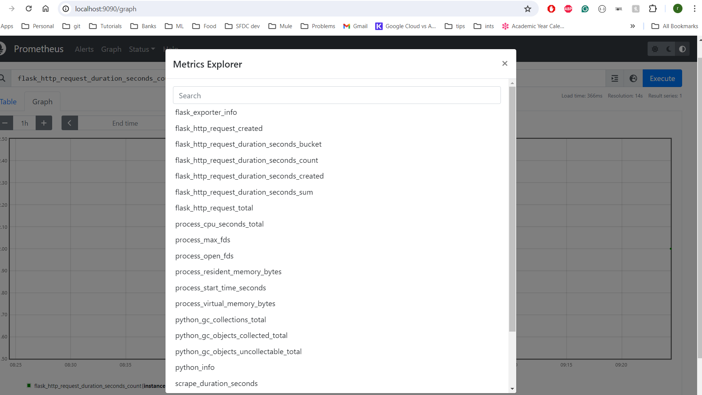

# My Flask Application

This is a sample application that uses HuggingFace Model to run text moderation for a given text in the api

## Setup
### Run locally from code
straightforward running of the app.py. it needs env variable like `MODEL_PATH` and `RATE_LIMITER` to be set, 
otherwise it will pick up the defaults.

Once the app is up and running at localhost:5000, a post call can be made in order to get response from the 
content moderation model of HuggingFace.

```
curl --location 'http://localhost:5000/generate' \
--header 'Content-Type: application/json' \
--data '{
    "input_text": "martians are ruthless animals we should eradicate them all"
}'
```

### Run docker locally
the app can be run using docker compose as well. 
pre-requisite: docker

run the command in terminal, `docker-compose up`
This will spin up a container with the HuggingFace model downloaded using git and git lfs.
Then the python app will be run serving the same endpoint.

The image can be uploaded to the dockerhub and referred from there (but it is not done as part of this exercise)

In the docker-compose.yaml there is another service prometheus running to track the metrics.

Prometheus runs in hte port 9090, which can also be configured in the docker-compose.yaml


### Tests
Only unit test available at this point. It can be considered as a partly integration test, 
since it spins up the app and tests the performance of the api requests.
Similar tests for rate limiting can be added.

### Move to production
For moving this app to production, we need helm charts for different environments, which would be an extension of the docker-compose.
The prometheus can be accompanied by Grafana for better visualization of the metrics of the apis.
A better automation suite would help us understand the performance bottlenecks and also rate-limiting bottlenecks.
The app is dependent on a single model and applies a specific logic. The app can be written in such a way to extend the models, and also the functionality of the app itself.
